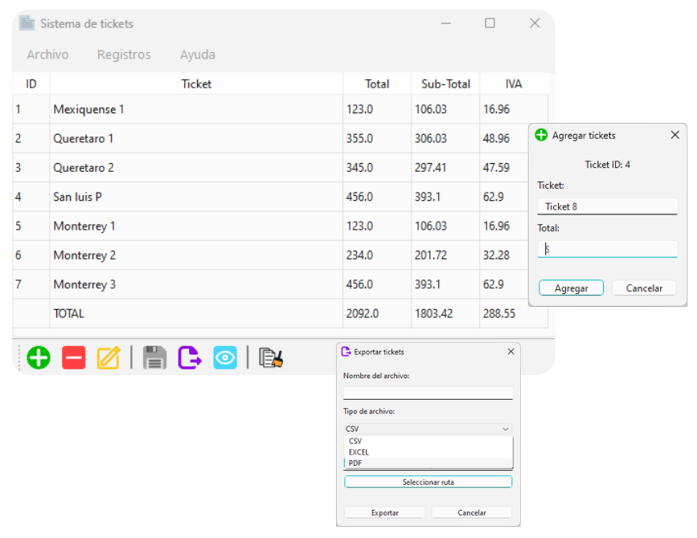

# Tickets Management System

Tickets system design meet the need for breaking down tickets into "Total" – "Sub-Total" – "Taxes" for later invoicing or presentation to commercial clients. In addition to the basic function of ticket breakdowns, it includes a record-keeping system, where frequently used ticket lists can be stored and accessed quickly and easily.

The Ticket System saves these records in a database located at C:\Users\{user}\.tickets, which is automatically created the first time the system runs. This database cannot be viewed with conventional methods, so it is recommended not to manipulate it unless you have knowledge of working with SQLite databases.

The system is programmed using the Python library PySide6 for the graphical interface and user interaction, along with libraries like Pandas and SQLite3 for data management. It is entirely written in Python due to its flexibility, ease of use, and scalability.

The main purpose of this system is to provide a tool for freight transport companies in Mexico, as they need to present ticket breakdowns to their clients to generate invoices for their services. However, it can also be adapted for other individuals needing to itemize their tickets, for instance, for travel expense reports or personal use.

## Screenshot

